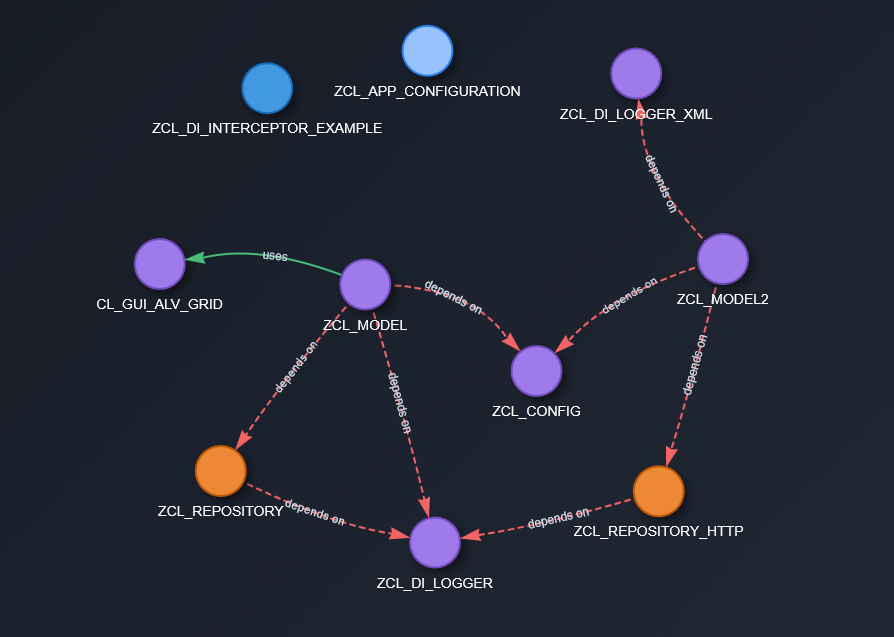

# DI2ABAP Framework
Современный фрэймворк внедрения зависимостей для SAP ABAP

## Фрэймворк на ABAP для механизма Dependency Injection
DI2ABAP - это легковесный фрэймворк внедрения зависимостей на основе аннотаций (поддерживается и императивный подход), который привносит все современные паттерны разработки в экосистему SAP. 
Вдохновленный Java Spring Framework и созданный специально с учетом ограничений ABAP, он обеспечивает более
чистую архитектуру, лучшую тестируемость и снижение связанности в приложениях.

## Структура проекта
```dotenv
|project/
|--- zdi2abap/ 			- Ядро, основные классы фрэймворка
|	|--- CLASSES/ 		- Классы
|	|--- INTERFACES/ 	- Интерфейсы
|	|--- MSGCLASS/ 		- Классы сообщений
|--- zdi2abap_documentation/ 	- Отчет-автодокументация для зависимостей
|	|--- CLASSES/ 		- Классы
|	|--- PROGRAMS/ 		- Отчеты
|	|--- INTERFACES/ 	- Интерфейсы
|	|--- INCLUDES/ 		- Инклюды
|	|--- TEMPLATES/ 	- Шаблоны для загрузки в SMW0
|--- zdi2abap_examples/		- Примеры
|--- README.md
|--- Annotations.md
```

## Ключевые возможности
- Внедрение зависимостей на основе аннотаций (@Component, @Inject, @Qualifier)
- Области видимости Singleton и Prototype
- Внедрение зависимостей через конструктор с помощью аннотации @Inject на атрибутах
- Обнаружение циклических зависимостей
- Управление жизненным циклом компонентов
- Возможность проксировать любые интерфейсы, относящиеся к компонентам и перехватывать before/after вызовы (для профайлинга, метрик, логирований)
- Императивный подход к управлению зависимостями, без прямого использования аннотаций, через классы расширения конфигурации. Возможность комбинировать императивный и декларативный подходы.
- Построение графа зависимостей с выводом в отчет с использованием Vis.js. Экспорт в JSON/PNG.



## Дизайн

```dotenv
┌─────────────────────────────────────────────────┐
│              ZCL_DI2ABAP                        │
│                (Facade)                         │
└───────────────┬─────────────────────────────────┘
                │
    ┌───────────┼───────────┐
    ▼           ▼           ▼
┌─────────┐ ┌───────┐ ┌────────┐
│Container│ │Scanner│ │Resolver│
└────┬────┘ └───────┘ └────────┘
     │
     ▼
┌─────────────────────────────────────────────────┐
│         Компоненты приложения                   │
│  ┌──────────┐   ┌──────────┐   ┌──────────┐     │
│  │ Services │   │Repository│   │ Others.. │     │
│  └──────────┘   └──────────┘   └──────────┘     │
└─────────────────────────────────────────────────┘
```

Контейнер - ZCL_DI_CONTAINER. Класс, ответственный за хранение инстанций всех компонентов.
Сканер - ZCL_DI_SCANNER. Сканирует классы в указанных пакетах. Парсит аннотации, формирует список зависисимостей для внедрения.
Resolver - Класс для решения конфликта зависимостей. Формирует правильную последовательность для инстанцирования зависимостей с помощью топологической сортировки.

## Как использовать
1. Создайте транспортный запрос
2. Создайте объекты в системе SAP
3. Скопируйте код из соответствующих файлов в одноименные объекты
4. Активируйте объекты
5. Смотрите примеры в пакете ZDI2ABAP_EXAMPLES

## Зависимости
- Требуется SAP_BASIS 740+

## Быстрый старт

1. Определите компоненты

```abap
"@Repository
CLASS zcl_user_repository DEFINITION
  PUBLIC
  CREATE PUBLIC .

  PUBLIC SECTION.

    INTERFACES zif_user_repository.

  PROTECTED SECTION.
  PRIVATE SECTION.
ENDCLASS.

"@Service
CLASS zcl_user_service DEFINITION
  PUBLIC
  CREATE PUBLIC .

  PUBLIC SECTION.

    INTERFACES zif_user_service .

    METHODS constructor
      IMPORTING
        io_repository TYPE REF TO object.
  PROTECTED SECTION.

    "@Inject( io_repository )
    DATA mo_repository TYPE REF TO zif_user_repository.
  PRIVATE SECTION.
ENDCLASS.
```


2. Получите компоненты из контейнера

```abap
DATA:
  lo_service 	TYPE REF TO zcl_user_service,
  lo_repository TYPE REF TO zif_user_repository.

DATA(lo_container) = zcl_di2abap=>get_instance( )->create_container(
                                                           VALUE #( ( `ZYOUPACKAGE` ) )
                                                         ).														 
lo_container->resolve( IMPORTING eo_instance = lo_service ).
lo_container->resolve( IMPORTING eo_instance = lo_repository ).
```

## Преимущества использования 

- Меньший процент шаблонного кода
- Автоматическое разрешение зависимостей, стандартизированное управление зависимостями
- Тестируемость с легким мокированием
- Чистое разделение ответственности

## Контакты
- Разработчик: Денисов Николай
- email: trash789012@gmail.com
- tg: @denials45